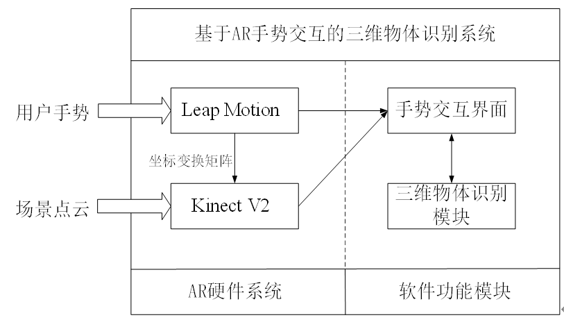
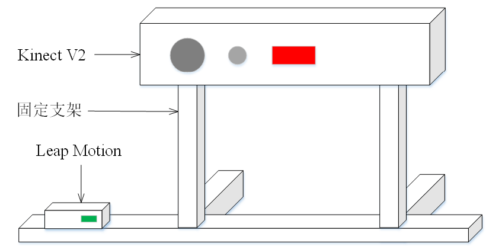
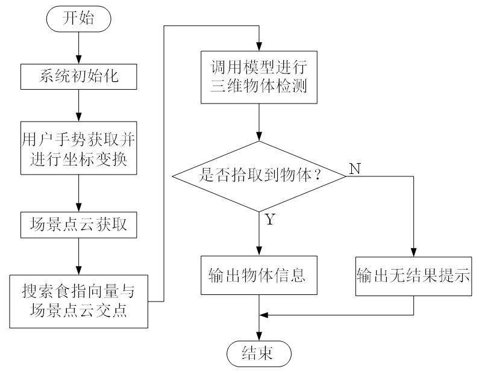
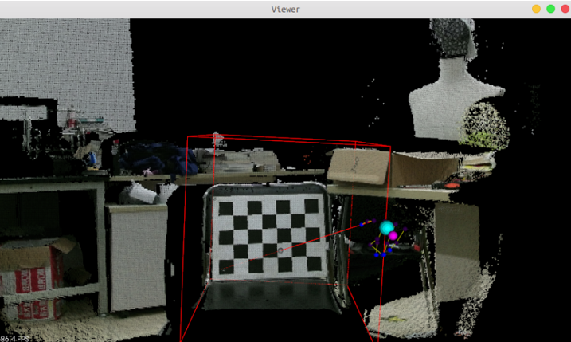
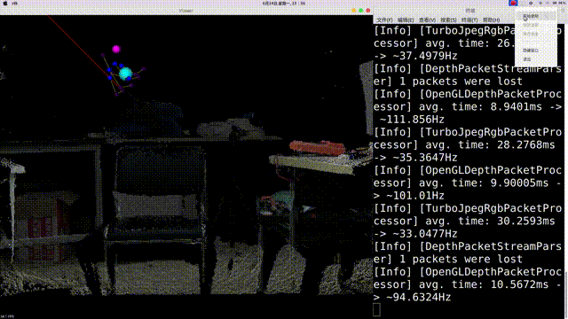

# Project

AR手势交互系统中三维物品识别方法

## 1. 介绍

&emsp;&emsp;实现一种基于AR手势交互的三维物品识别系统。该系统可同时探测手部和场景信息，通过手部关节三维坐标信息对手型进行建模显示，同时将区域内物体表面深度和颜色信息可视化，用户可通过AR系统显示的食指指向延长线来拾取目标物体，获得延长线与目标物体点云的交点坐标，进而由深度学习网络识别场景点云中一定类别的物体并得到物体语义类别和三维空间包围框坐标信息，通过几何计算便可判断交点与各物体包围框的物理空间关系，得到被拾取目标的语义分类和可视化包围框信息。

&emsp;&emsp;整体系统分为硬件和软件两大部分。硬件部分包括Kinect V2和Leap Motion组成的多相机系统，由Leap Motion进行用户手势指向检测，Kinect V2则面向前方场景，负责采集包含目标物体的颜色和三维点云。两个相机事先已通过相机标定确定了相对位置关系，Leap Motion探测得到的手部模型空间位置可通过两传感器间的位置坐标变换矩阵变换到Kinect V2相机坐标系下以实现坐标系的统一。软件部分包括VoteNet三维物体识别模块和现有的AR手势可视化交互界面，VoteNet深度学习网络使用PyTorch框架实现，交互界面使用PCL点云库实现。受现有现有数据集限制，系统可识别的物体类别较少，一般是椅子、桌子等体积较大的物体，尚未实现对水杯、苹果等较小体积物体的三维识别。

图1 系统总体设计

图2 AR手势交互硬件示意图

## 2. 软件环境

- 在Ubuntu18.04系统中进行设计和实现，包含分别基于C++和Python语言开发的两个工程文件。
  - C++工程为使用Qt Creator建立的C++控制台程序利用opengl图形库，该控制台程序可实现场景和手部在界面中可视化显示(点云可视化:PCL Visualizer)、Python工程中的函数调用和终端界面的信息输出(or TCP)
  - Python工程使用PyCharm开发，负责模型调用及相关数据处理和数据解析的任务。

&emsp;&emsp;三维物品识别使用VoteNet网络，数据集采用SUN-RGBD数据集。SUN-RGBD数据集对37个对象类别进行了标注以用于三维场景理解。在PyTorch框架下进行模型训练。模型训练的具体的环境配置为：Ubuntu20.04系统，PyTorch 1.2，CUDA10.0，cuDNN v7.6.5，Python3.7.0。

## 3. 软件架构

&emsp;&emsp;软件架构说明

图3 软件工作流程图

图3 软件工作流程图

## 4. 安装教程

1.  xxxx
2.  xxxx
3.  xxxx

## 5. 使用说明

&emsp;&emsp;测试视频:[test video](Project/picture/gesture_test.mp4)

